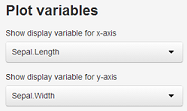
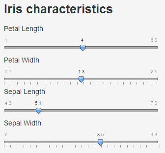

## Using the app

* The app is located at https://randomjohn.shinyapps.io/flower/
* Use the **Plot variables** list boxes to choose the graph



* Use the sliders to define your new measurement to be classified



---

## How the prediction is made

The prediction is made through a classification tree. For example, suppose we wanted to classify an iris with sepal length of 3.0 cm, sepal width of 1.5 cm, petal length of 3.0 cm, and petal width of 1.5cm, we would proceed as follows:


```r
library(rpart)
data(iris)
fit <- rpart(Species ~ ., data = iris)
potential <- data.frame(Sepal.Width = 1.5, Sepal.Length = 3, Petal.Width = 1.5, 
    Petal.Length = 3)
as.character(predict(fit, potential, type = "class"))
```

```
## [1] "versicolor"
```


---

## Misclassification

Because of the way classification trees work, a prediction may be different from its apparent neighbors.


